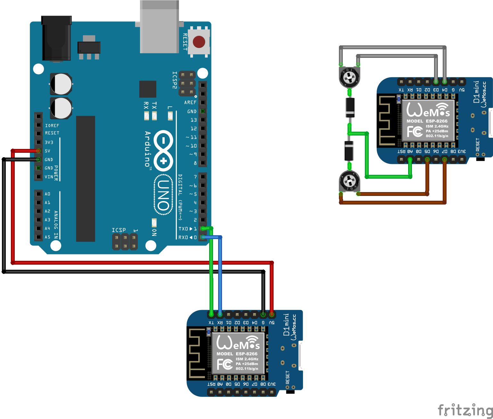
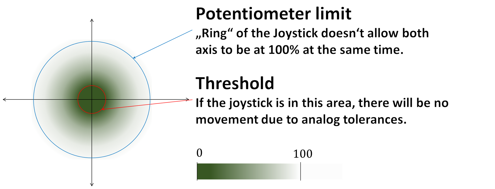

# drivingSuitcase
## Function
Using ESP-Now to control two stepper motors remotely, mounted on a suitcase and inside a remote controll to create a pointless, but funny driving suitcase. 
Note that this project isn't considered being an optimal solution, rather a proof of concept, showing the capability of ESP-Now and testing Arduino-Wemos transmission over a Serial connection.

# Hardware
This is the hardware I used because it was already set up.
There are obviously better combinations available, but this worked for me fine.
- 2x Wemos D1 mini
- 1x Arduino Uno
- 1x generic dual stepper driver shield
- 2x steppers
- 1x analog 2D-Joystick (mine were two 10kΩ linear potentiometers)
- 2x generic diodes

## Disclaimer
A Wemos is rated for 3.3V input, not 5V, by connecting the Wemos to the Arduino over RX/TX you risk burning him. Many people are operating such a combination without problems for months, but your hardware might be less lucky. Everything is at your own risk.

## Wiring

### Setup instructions
1. Connect the Joystick to the other Wemos, using two Digital Outputs at the outer connections (represented in the diagram by two potentiometers).
0. Solder a diode with the anode to the terminal pin (the middle one) of the potentiometer
0. Connect the cathodes of the diodes together and link it to the analog input of the Wemos (A0).
0. Put the motor shield on the Arduino
0. Connect one Wemos with the Arduino, using 5V/Ground RX/TX (3V3 would be probably fine too).
0. Set `IRef` of the motor shield, to avoid damage and overheating of the motor drivers. You probably should add a cooler for longer operation.

# Software
The remote control sends 10 times per second the current state of the joystick over ESPnow to the receiver. You might use higher values for a more dynamic control. 
Since an ESP8266 has a far superior processor compared to the arduino, processing the Joystick input is done on the receiving Wemos module.
## Used libraries
- [AccelStepper](http://www.airspayce.com/mikem/arduino/AccelStepper/)
- ESPnow implementation `inspired` by https://github.com/leonyuhanov/ESP-NOW-TX-RX
## Data flow
1. The Wemos of the Remote Control reads the position of the Joystick and sends it in unmodified binary form over ESPnow
0. The other Wemos receives the signal, applies the input scale and threshold to map the joystick's position to an X/Y value from -100 to +100. Then it calculates the instruction for the left and right motor and sends it over the Serial connection to the Arduino. Because of the hardware limit of the Joystick, there's no need for limiting the cumulative X/Y sum. If your joystick has a square instead of a circle as operating range you need to implement a `constrain` there.

0. The Arduino constantly monitors the Serial input, if the input contains 10 chars and a `\n ` newline, it tries to parse it. The data should be formatted as `L0000R0000`,`L` and `R` are ignored but both chars is required as padding. The values for the motors are the amount of steps relative to the current position and MUST have 4 digits.

### Joystick calibration
Because every Joystick behaves different, you need to calibrate it by setting the threshold values to avoid motor shaking in the joysticks initial position.
It is important for calibration that you take in account the power supply voltage and the current draw of the diodes.
### Customization
- `Measurements per second` (default 10) defines how many times the remote reads the state of the Joystick per second. Increase this value to make the control more responsive. By increasing it, you might need to turn the `Speed multiplier` down, since the processed Joystick position is added to the target position of the motors.

- `Speed multiplier` (default 3) is the multiplier applied on the processed Joystick input which ranges from -100 to +100. 

- `Motor acceleration` (default 100) is the change of steps per second each second (steps/s²). Increasing it will make the control more dynamic but may lead to torque problems up to motor stalling for higher loads.

- `Motor speed` (default 300) is the maximum amount of steps per second the motors. A too high motor speed might cause the steppers to make 'clicking' noises instead of rotating properly.

## Since the project is finished for me, I do not develop this project any further. Feel free to fork and PR.

### some random notes
- Use a power supply for the motor shield during development. At the beginning, the motor shield was powered by a LiPo battery which had too low current which made it impossible to programm the Arduino since the voltage level was dropping too far.
- Think about the calculation speed of your microcontrollers! An Arduino might seem bigger than a Wemos, but doing all the input mapping on it can consume too much time, causing 'lost steps'.
- use input abstraction - at the beginning of the project the absolute joystick measurements were mapped to the left/right motor speed which led to problems when I was using the Wemos with a battery supply which caused the absolute values to drop from 500 in the center to around 350 on battery. By using an abstraction layer, in this case mapping the absolute values to a -100 to +100 X/Y axis it's way easier to debug and adjust.
- monitor your hardware! I had problems because my motor drivers were getting too hot, loosing torque and skipping steps. Use heatsinks, it will save you a lot of trouble.

### Additional notes
While the suitcase was driving quite satisfying, stepper motors seem to be the wrong decision here. When you don't need a millimeter accurate positioning system, use  normal boring DC motors. In general, if you're not into software, it's better using the electronics of a cheap RC car and tuning it instead of building it on your own. I was really surprised of the good speed of ESPnow, but for better range and increased dynamic it would be probably better using a more analog radio approach like the RC toys are doing.